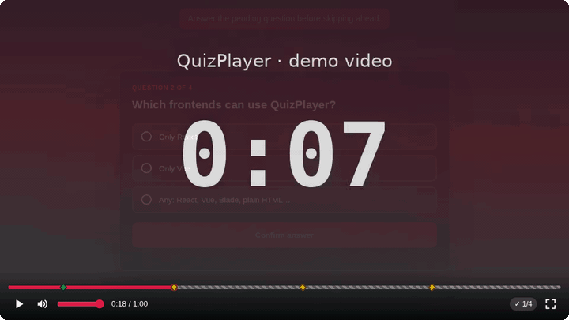

<div align="center">

# ▶ QuizPlayer

**Videos, die anhalten, piepen und fragen.**
Ein Open-Source-HTML5-Videoplayer mit eingebetteten Quizfragen, der mit **jedem Frontend** und **jedem Backend** funktioniert.

[English](../README.md) · [Português](README.pt-BR.md) · [Español](README.es.md) · [Français](README.fr.md) · **Deutsch** · [中文](README.zh-CN.md) · [日本語](README.ja.md)

[](https://github.com/IrvingSamuel/quizplayer/actions/workflows/ci.yml)
[](../LICENSE)


[](https://github.com/IrvingSamuel/quizplayer/stargazers)

[**Live-Demo**](https://irvingsamuel.github.io/quizplayer/) · [Beispiele](../examples) · [Protokollspezifikation](../spec/protocol.md)



</div>

---

## Warum QuizPlayer?

Interaktive Videos steigern Aufmerksamkeit und Lernerfolg, doch die meisten Lösungen sind kostenpflichtige SaaS-Produkte, binden dich an ein einziges Framework oder prüfen die richtige Antwort im Browser, wo sie jeder auslesen kann.

QuizPlayer ist anders:

- **Anhalten → Piepen → Fragen.** Das Video stoppt genau an der Sekunde, die du festlegst, spielt einen kurzen synthetisierten Piepton ab und zeigt die Frage an. Keine Audiodateien, keine Netzwerkaufrufe.
- **Jedes Frontend.** Ein Kern ohne Abhängigkeiten (~14 kB gzip) plus offizielle **React**- und **Vue**-Komponenten. **Blade-, Twig-, Django-, Rails- und Go-Templates** funktionieren mit einfachen HTML-Attributen, genau wie jedes andere Framework.
- **Jedes Backend.** Ein winziges [JSON-Protokoll](../spec/protocol.md) mit offiziellen SDKs für **PHP/Laravel**, **Go** und **Node.js** (Express, Next.js, Hono, Bun, Deno). Andere Sprachen können es in etwa 50 Zeilen implementieren.
- **Schummelsicher.** Mit einem `endpoint` gelangen die richtigen Antworten nie auf die Seite: Der Server validiert und speichert jede Antwort.
- **Vorspulschutz.** Verhindere optional, dass über eine noch nicht beantwortete Frage hinausgespult wird.
- **Fortsetzen.** Frühere Antworten werden wiederhergestellt, und die zuschauende Person wird gefragt, ob sie *„erneut antworten?“* möchte.
- **Barrierefrei.** Tastaturnavigation, Fokusfalle, ARIA-Live-Regionen und `prefers-reduced-motion`.
- **7 Sprachen integriert** (en, pt-BR, es, fr, de, zh-CN, ja). Jeder Text lässt sich überschreiben.
- **Anpassbar** über CSS Custom Properties und **responsiv**: Das Quiz passt sich auch winzigen Playern auf Smartphones an.

## Schnellstart (30 Sekunden)

```html
<div id="player"></div>

<script src="https://cdn.jsdelivr.net/npm/@quizplayer/core@0/dist/quizplayer.min.js"></script>
<script>
  QuizPlayer.create('#player', {
    src: '/videos/lesson-1.mp4',
    quizzes: [
      {
        id: 'q1',
        time: 42, // Sekunden
        question: 'Which protocol does HTTPS add on top of HTTP?',
        options: [
          { id: 'a', text: 'FTP' },
          { id: 'b', text: 'TLS' },
        ],
        correct: 'b',
        explanation: 'HTTPS is HTTP over TLS.',
      },
    ],
    onAnswer: ({ record }) => console.log(record),
  });
</script>
```

## Pakete

| Paket | Installation | Für |
| --- | --- | --- |
| [`@quizplayer/core`](../packages/core) | `npm i @quizplayer/core` oder das CDN-`<script>` | Vanilla JS, Svelte, Angular, Alpine, Blade, beliebiges HTML |
| [`@quizplayer/react`](../packages/react) | `npm i @quizplayer/react` | React 17+ / Next.js |
| [`@quizplayer/vue`](../packages/vue) | `npm i @quizplayer/vue` | Vue 3 / Nuxt |
| [`@quizplayer/server`](../packages/node) | `npm i @quizplayer/server` | Node.js: Express, Next.js, Hono, Bun, Deno |
| [`quizplayer/quizplayer`](../php) | `composer require quizplayer/quizplayer` | PHP 8.1+, Laravel, Symfony, WordPress |
| [`quizplayer/go`](../go) | `go get github.com/IrvingSamuel/quizplayer/go` | Go `net/http`, chi, gin, echo |

---

## Frontend

### Reines HTML / serverseitige Templates (kein eigenes JavaScript nötig)

Jedes `[data-quizplayer]`-Element wird automatisch vom CDN-Bundle initialisiert. Das funktioniert genauso in Blade, Twig, Jinja/Django, ERB, Go `html/template`, Thymeleaf …

```html
<div data-quizplayer
     data-src="/videos/lesson-1.mp4"
     data-video-id="lesson-1"
     data-endpoint="/api/quizplayer"
     data-locale="pt-BR"
     data-prevent-skip="true">
  <script type="application/json">
    [{ "id": "q1", "time": 42, "question": "…", "options": [{ "id": "a", "text": "…" }, { "id": "b", "text": "…" }] }]
  </script>
</div>
<script src="https://cdn.jsdelivr.net/npm/@quizplayer/core@0/dist/quizplayer.min.js" defer></script>
```

Unterstützte Attribute: `data-src`, `data-poster`, `data-video-id`, `data-endpoint`, `data-locale`, `data-prevent-skip`, `data-replay-on-rewind`, `data-auto-continue` (ms), `data-sounds`, `data-fill`, `data-muted`, `data-autoplay`, `data-quizzes` (JSON oder `#id` eines JSON-`<script>`) und `data-options` (JSON mit beliebigen weiteren Optionen).

Du kannst auch ein vorhandenes `<video>` einbinden: `QuizPlayer.create(document.querySelector('video'), { quizzes })`.

### ES-Module / Bundler

```js
import { QuizPlayer } from '@quizplayer/core';

const player = QuizPlayer.create('#player', { src, quizzes, locale: 'es' });
player.on('answer', ({ quiz, record, result }) => { /* … */ });
```

### React

```tsx
import { QuizPlayer } from '@quizplayer/react';

export function Lesson({ lesson }) {
  return (
    <QuizPlayer
      src={lesson.videoUrl}
      quizzes={lesson.quizzes}
      videoId={lesson.id}
      endpoint="/api/quizplayer"
      preventSkip
      onComplete={(results) => console.log(results.score)}
    />
  );
}
```

Die `ref` stellt die `QuizPlayer`-Instanz bereit, außerdem gibt es einen `useQuizPlayer(options)`-Hook. Siehe [examples/react-vite](../examples/react-vite).

### Vue 3

```vue
<script setup>
import { QuizPlayer } from '@quizplayer/vue';
</script>

<template>
  <QuizPlayer :src="lesson.videoUrl" :quizzes="lesson.quizzes" :video-id="lesson.id"
              endpoint="/api/quizplayer" prevent-skip @complete="onComplete" />
</template>
```

Events: `ready`, `quizshow`, `answer`, `continue`, `complete`, `seekblocked`, `error`. Du kannst die Komponente mit `app.use(QuizPlayerPlugin)` global registrieren. Siehe [examples/vue-vite](../examples/vue-vite).

### Laravel Blade

```blade
<x-quizplayer :src="$lesson->video_url" :quizzes="$lesson->quizzes" :video-id="$lesson->id" prevent-skip />
```

Siehe [Laravel-Backend](#php--laravel) weiter unten. Die Komponente entfernt die Antworten und verbindet den Endpoint automatisch für dich.

### Svelte, Angular, Solid, Alpine, htmx …

Verwende direkt den Kern: `QuizPlayer.create(element, options)` beim Mounten und `player.destroy()` beim Unmounten.

---

## Backend

Der Player kommuniziert mit deinem Server über ein [winziges JSON-Protokoll](../spec/protocol.md):

| Methode | Pfad | Zweck |
| --- | --- | --- |
| `POST` | `{endpoint}/answer` | Eine Antwort validieren, speichern und `{ correct, correctOptionId, explanation }` zurückgeben |
| `GET` | `{endpoint}/answers?videoId=` | Frühere Antworten des aktuellen Nutzers (Fortsetzen) |
| `GET` | `{endpoint}/quizzes?videoId=` | Quizfragen **ohne** Antworten (optional) |
| `GET` | `{endpoint}/results?videoId=` | Punkteübersicht (optional) |

Die Identität des Nutzers stammt aus deiner eigenen Session oder deinem Token, daher befasst sich das Protokoll nie mit Authentifizierung.

### Node.js (Express, Next.js, Hono, Bun, Deno)

```js
import express from 'express';
import { createNodeHandler } from '@quizplayer/server';

app.use('/api/quizplayer', express.json(), createNodeHandler({
  getQuizzes: (videoId) => db.lessons.quizzes(videoId), // mit den richtigen Antworten
  getUserId: (req) => req.session.userId,
  store: myAnswerStore, // { save(answer), list(videoId, userId) }; standardmäßig im Arbeitsspeicher
}));
```

Fetch-API-Runtimes (Next.js Route Handlers, Hono, Bun, Deno, Cloudflare Workers):

```ts
// app/api/quizplayer/[...path]/route.ts
import { createFetchHandler } from '@quizplayer/server';
const handler = createFetchHandler({ getQuizzes, getUserId }, '/api/quizplayer');
export { handler as GET, handler as POST };
```

### PHP / Laravel

**Laravel.** Das Paket wird automatisch erkannt und registriert Routen, die Blade-Komponente, die Konfiguration und die Migration:

```bash
composer require quizplayer/quizplayer
php artisan vendor:publish --tag=quizplayer && php artisan migrate
```

```php
// config/quizplayer.php
'quizzes' => App\QuizPlayer\LessonQuizzes::class, // implementiert QuizPlayer\Laravel\QuizProvider
```

Vollständige Anleitung: [examples/laravel](../examples/laravel).

**Reines PHP, Symfony, Slim, WordPress …**

```php
use QuizPlayer\Server;
use QuizPlayer\Store\PdoStore;

$server = new Server(
    getQuizzes: fn (string $videoId) => $repo->quizzesFor($videoId),
    store: new PdoStore($pdo),             // MySQL, PostgreSQL, SQLite, SQL Server
    getUserId: fn () => $_SESSION['user_id'] ?? null,
);
$server->respond('/api/quizplayer');       // oder $server->handle($method, $path, $query, $body)

echo QuizPlayer\Html::render(['src' => '/lesson.mp4', 'quizzes' => $quizzes, 'endpoint' => '/api/quizplayer']);
```

### Go

```go
import quizplayer "github.com/IrvingSamuel/quizplayer/go"

h := quizplayer.NewHandler(quizplayer.Config{
    Quizzes: func(r *http.Request, videoID string) ([]quizplayer.Quiz, error) { return repo.Quizzes(videoID) },
    Store:   myStore, // implementiert quizplayer.Store; standardmäßig NewMemoryStore()
    UserID:  func(r *http.Request) string { return session.UserID(r) },
})
http.Handle("/api/quizplayer/", http.StripPrefix("/api/quizplayer", h))
```

### Python, Ruby, Java, .NET, Rust …

Implementiere `POST /answer` gemäß [spec/protocol.md](../spec/protocol.md); `GET /answers` ist optional. Beiträge in Form offizieller SDKs sind herzlich willkommen.

---

## Quiz-Format

```jsonc
{
  "id": "q1",                 // stabile ID: Antworten werden darunter gespeichert
  "time": 42.5,               // Sekunden ("1:30" wird ebenfalls akzeptiert)
  "question": "…",
  "options": [{ "id": "a", "text": "…" }, { "id": "b", "text": "…" }],
  "correct": "b",             // bei Umfragen weglassen oder wenn der Server validiert
  "explanation": "…",         // optional, wird nach dem Antworten angezeigt
  "audioUrl": "…/narration.mp3" // optional, wird abgespielt, solange das Quiz geöffnet ist
}
```

`normalizeQuizzes()` (JS), `Quizzes::normalize()` (PHP) und `quizplayer.Normalize()` (Go) akzeptieren auch Kurzformate: `options: ["A", "B"]` mit `correct: 1`, ältere `[text, isCorrect]`-Tupel sowie die Schlüssel `point` / `title` / `answers`. JSON Schema: [spec/quiz.schema.json](../spec/quiz.schema.json).

## Optionen

| Option | Standard | Beschreibung |
| --- | --- | --- |
| `src` | — | Video-URL oder `[{ src, type }]`-Liste |
| `quizzes` | `[]` | Quizfragen (Array oder JSON-String) |
| `videoId` | — | Wird mit jeder Antwort an dein Backend gesendet |
| `endpoint` | — | Basis-URL eines Backends, das das Protokoll implementiert (serverseitige Validierung) |
| `locale` | `<html lang>` | `en`, `pt-BR`, `es`, `fr`, `de`, `zh-CN`, `ja` |
| `messages` | — | Beliebige UI-Texte überschreiben |
| `preventSkip` | `false` | Vorspulen über das erste unbeantwortete Quiz hinaus verhindern |
| `autoContinueMs` | `3000` | Nach dem Antworten automatisch fortsetzen (`0` = auf Klick warten) |
| `replayOnRewind` | `false` | Quizfragen erneut anzeigen, wenn vor sie zurückgespult wird |
| `askAgainSeconds` | `5` | Countdown der Abfrage „bereits beantwortet“ |
| `previousAnswers` | — | Wiederherzustellende Antworten (statt `GET /answers`) |
| `sounds` | `true` | `false` oder `{ cue, correct, wrong, volume }` mit URLs, die die synthetisierten Töne ersetzen |
| `headers` | — | Zusätzliche Request-Header (Objekt oder Funktion), z. B. `Authorization` |
| `csrfMeta` | `'csrf-token'` | `<meta>`, das für den `X-CSRF-TOKEN`-Header ausgelesen wird (`false` zum Deaktivieren) |
| `validateAnswer` | — | Eigener asynchroner Validator (GraphQL, Firebase …) |
| `loadAnswers` | — | Eigener asynchroner Loader für frühere Antworten |
| `poster`, `autoplay`, `muted`, `crossOrigin` | — | Native Video-Attribute |
| `fill` | `false` | Die Höhe des Elternelements ausfüllen statt 16:9 |
| `markers` | `true` | Quiz-Markierungen auf der Fortschrittsleiste anzeigen |
| `injectStyles` | `true` | Das Standard-CSS einfügen (oder `@quizplayer/core/style.css` importieren) |

## Events & Methoden

```js
const off = player.on('answer', ({ quiz, record, result }) => {});
// Events: ready · quizshow · answer · continue · complete · seekblocked · error
// oder Callbacks: onReady, onQuizShow, onAnswer, onContinue, onComplete, onSeekBlocked, onError

player.play(); player.pause(); player.seek(30);
player.getResults();   // { total, answered, correct, score, answers }
player.getAnswers(); player.getQuizzes(); player.setQuizzes(list);
player.showQuiz('q1'); player.reset(); player.destroy();
player.video;          // das zugrunde liegende <video>-Element
```

## Theming

```css
.qp-root {
  --qp-primary: #7c3aed;      /* Buttons, Fortschritt, Hervorhebungen */
  --qp-surface: #111827;      /* Quiz-Karte */
  --qp-radius: 16px;
  --qp-font: "Inter", sans-serif;
}
```

Weitere Variablen: `--qp-primary-contrast`, `--qp-bg`, `--qp-surface-2`, `--qp-border`, `--qp-text`, `--qp-muted`, `--qp-success`, `--qp-danger`.

## Tastatur

| Taste | Aktion |
| --- | --- |
| `Space` / `K` | Abspielen / Pause |
| `←` / `→` | −5 s / +5 s spulen (`Shift` = 10 s auf der Fortschrittsleiste) |
| `F` / `M` | Vollbild / Stummschalten |
| `↑` `↓` | Zwischen Antworten wechseln (innerhalb eines Quiz) |
| `Tab` | Der Fokus bleibt im Quiz, bis es beantwortet ist |

## Sicherheitshinweise

- Wenn ein `endpoint` gesetzt ist, **gib `correct` nicht in die Seite aus**. Verwende `stripAnswers()`, `Quizzes::strip()` oder `quizplayer.Strip()`; `Html::render()` und `<x-quizplayer>` erledigen das automatisch.
- Server müssen jedes vom Client gesendete `correct`-Feld ignorieren. Alle offiziellen SDKs tun das.
- Der Vorspulschutz und die clientseitigen Prüfungen verbessern das Seherlebnis, sind aber kein DRM. Alles, was im Browser läuft, lässt sich umgehen.

## Browser-Unterstützung

Chrome / Edge 111+, Firefox 113+ und Safari 16.2+ (Desktop, iOS und Android). Jedes Format, das der Browser abspielen kann, funktioniert: MP4/H.264, WebM, HLS in Safari oder HLS/DASH anderswo, indem du hls.js oder dash.js an `player.video` anbindest.

## Roadmap

- [ ] Adapter für YouTube und Vimeo
- [ ] Fragen mit Mehrfachauswahl und Freitext
- [ ] Wrapper für Svelte und Angular
- [ ] SDKs für Python (Django/FastAPI) und Ruby (Rails)
- [ ] WordPress-Plugin
- [ ] Visueller Quiz-Editor (Zeitleiste)
- [ ] xAPI-/SCORM-Statements

Hast du eine Idee? [Starte eine Diskussion](https://github.com/IrvingSamuel/quizplayer/discussions) oder [eröffne ein Issue](https://github.com/IrvingSamuel/quizplayer/issues).

## Entwicklung

```bash
git clone https://github.com/IrvingSamuel/quizplayer && cd quizplayer
npm install && npm run build && npm test     # JS/TS-Pakete
composer install && vendor/bin/phpunit       # PHP + Laravel
cd go && go test ./...                       # Go
npm run demo                                 # Demo unter http://localhost:3000
```

Siehe [CONTRIBUTING.md](../CONTRIBUTING.md).

## Unterstütze das Projekt

Wenn dir QuizPlayer Zeit spart, **gib ihm bitte einen ⭐ auf GitHub**. Sterne helfen anderen Entwicklerinnen und Entwicklern, das Projekt zu finden.

[](https://star-history.com/#IrvingSamuel/quizplayer&Date)

## Lizenz

[MIT](../LICENSE) © Irving Samuel
